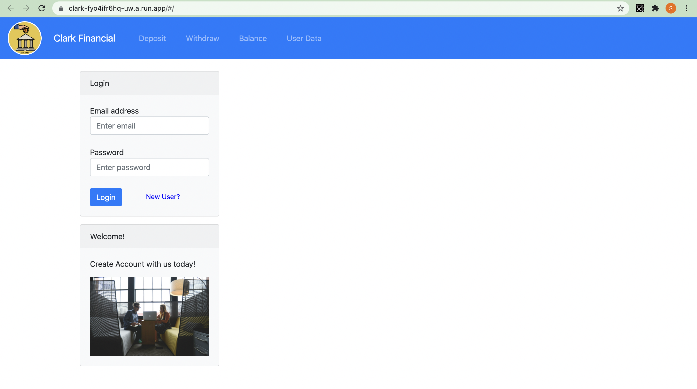
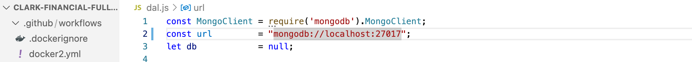

# Clark-Financial-Full-Stack
<br>
<div align="center" height="400px" width="600px">
  
</div>
<br>

## About
Clark financial is a full-stack banking application. Allows the user to create account, login, and keep track of deposits and withdraws. It has capability to store data of each user and retrieve that data on login. Clark Financial is a project that is ongoing and was the capstone project for my coursework at MIT x Pro. 

## Technologies
* [React](https://reactjs.org/)
* [Node.js](https://nodejs.org/en/)
* [Docker](https://www.docker.com/)
* [MongoDB](https://www.mongodb.com/)
* [Bootstrap](https://getbootstrap.com/)

## How to Run
### Prereq
* npm
  ```sh
  npm install npm@latest -g
  ```
### Locally
1. Clone the repo
   ```sh
   git clone https://github.com/samclark1999/Clark-Financial-Full-Stack
   ```
2. Install NPM packages
   ```sh
   npm install
   ```
3. Change const url to following url string "" in the dal.js file
  <br>
    
  </br>
4. Run the Node server
   ```sh
   node index.js
   ```
5. Navigate to [http://localhost:3000/](http://localhost:3000/) to run the application
